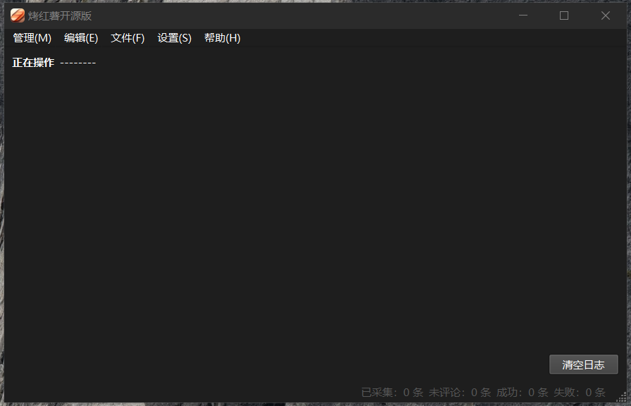
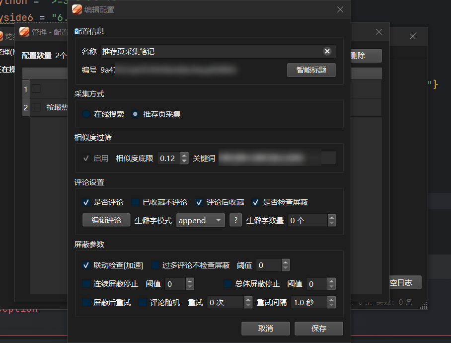

## 项目：烤红薯开源版

> 一旦发现除 `觅码_顾平安` 外的用户在闲鱼等平台售卖、非法商用，本包将停止维护以及下架仓库，并不再免费共享给社区人员（真是不把人的劳动成果当成果...）

该项目是基于 `PySide6` 和 `xhs-api` 所开发的某红书自动化工具，无任何后门，可放心使用。

如有侵犯贵司或组织的权益，请尽快联系我删除仓库，仅供技术研究，请勿做非法使用。

>  功能：多账号自动化并发采集笔记、点赞评论收藏笔记、检查评论屏蔽、艾特用户、红薯号登录、账号管理、配置管理...（尽管如此，该开源版本相对给客户所定制的版本阉割了很多功能）

### 界面





### 部署和运行

环境依赖管理基于 `poetry`，因此请务必先安装 `poetry`：

```bash
pip install poetry  # 你可以使用 -i 镜像源地址 加速下载
```

接下来请安装依赖：

```bash
# 为了限制应用泛滥而导致官方接口变动，请自行留下邮箱，我将发送本地依赖 xhs-api 包（无收费）
# xhs-api 的包文件放于 项目根目录/pack/packages 该路径下
poetry lock
poetry install
npm install jsdom  # 开发情况下请务必安装好 nodejs（作者开发时的版本：v20.11.1）
```

开发情景下：
- Pycharm 中设置好 poetry 环境后，可直接运行 `main.py` 入口文件
- 终端环境中运行，键入命令：`poetry run python main.py`

应用默认是单例运行，如需修改请自行查看 `app` 包的 `__init__.py` 文件。

如果你需要打包成 `exe` 可执行文件，请务必参考下方提示。

首先，项目仅支持 Windows 端，推荐 Win10 起步（Wind 7/8未测试），因为修改了部分 `execjs` 库的源码，所以打包已经支持将`nodejs`环境以及 `jsdom` 也打包进入程序中，也就意味着，打包后的程序无需多余的安装`nodejs`相关环境，在多台主机已测试，可行。如果需要打包文件 `main.spec`（收费 20 元，技术不易、生活不易。有能力的话，你也可以根据当前项目的源码自行解决，这样避免金钱的流失，此处收费仅作为大佬们对我的打赏），同样，请留下联系方式（邮箱）。

将 `main.spec` 文件置于项目根目录，运行命令：

```
pyinstaller ./main.spec  # 注意生成的 dist 目录即可
```

### 项目依赖

该项目用到的库基本上都是开源免费的，感谢其作者或团队杰出的作品，以下排名不分先后。

- [PySide6](https://doc.qt.io/qtforpython-6/index.html): PySide6 是 Qt for Python 的官方绑定，它提供了一个强大的工具集，用于创建跨平台的图形用户界面（GUI）。
- [loguru](https://github.com/Delgan/loguru): Loguru 是一个用于 Python 的现代日志记录库，旨在简化日志记录过程并提供丰富的功能。
- [requests](https://github.com/psf/requests): Requests 是一个简单易用的 HTTP 库，适用于 Python。
- [wmi](https://github.com/tjguk/wmi): WMI 是一个用于 Windows Management Instrumentation 的 Python 包，允许在 Windows 系统上执行管理任务。
- [pyinstaller](https://github.com/pyinstaller/pyinstaller): PyInstaller 是一个将 Python 程序打包为独立可执行文件的工具。它支持 Windows、Mac 和 Linux 平台。
- [pyee](https://pypi.org/project/pyee/): Pyee 是一个简单的事件驱动库，灵感来自 Node.js 的 EventEmitter。
- [toml](https://github.com/uiri/toml): TOML 是一种简单的配置文件格式，易于人类阅读和编写。
- [pyppeteer](https://github.com/pyppeteer/pyppeteer): Pyppeteer 是 Puppeteer 的 Python 端口，用于控制无头 Chrome 或 Chromium 浏览器。
- [pywin32](https://github.com/mhammond/pywin32): PyWin32 提供了对 Windows API 的访问，使得在 Windows 上进行系统编程变得更加简单。
- [qrcode](https://github.com/lincolnloop/python-qrcode): QRCode 是一个用于生成二维码的 Python 库，简单易用。
- [execjs](https://github.com/doloopwhile/PyExecJS): ExecJS 是一个用于在 Python 中执行 JavaScript 代码的库。它提供了一个简单的接口，可以使用多种 JavaScript 运行时（如 Node.js、JScript 等）来执行 JavaScript 代码。


