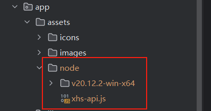

## 项目：烤红薯开源版

> 关于 `y-xhs` 包，已经不再免费共享，具体请查看：[关于 Donate](https://github.com/gupingan/khs-pyside6/issues/20)

该项目是基于 `PySide6` 和 `y-xhs` 所开发的某红薯自动化评论工具，可放心食用。

>  功能：多账号并发采集、点赞、评论、收藏笔记，可检查评论是否屏蔽，支持艾特用户，红薯号管理、持久配置管理... （尽管如此，该版本相对 Full 版阉割了很多功能）

### 界面


### 部署和运行

环境依赖管理基于 `poetry`，因此请务必先安装 `poetry`：

```bash
pip install poetry  # 你可以使用 -i 镜像源地址 加速下载
```

接下来请安装依赖：

```bash
# 为了限制应用泛滥而导致官方接口变动，打赏后请自行留下邮箱，我将发送本地依赖 y-xhs 包以及缺乏的 node 文件夹
# y-xhs 的包文件放于 项目根目录/pack/packages 该路径下，如果路径不存在，请手动创建即可
poetry lock
poetry install
```

项目中，默认不上传 `node` 文件夹的。在您打赏后，请您在 issues 中特别告知你需要的不仅仅是 y-xhs，还有 node 目录以及打包配置。

该目录在您接收到后，请按一下路径复制：



开发情景下：
- Pycharm 中设置好 poetry 环境后，可直接运行 `main.py` 入口文件
- 终端环境中运行，键入命令：`poetry run python main.py`

应用默认是单例运行，如需修改请自行查看 `app` 包的 `__init__.py` 文件。

如果你需要打包成 `exe` 可执行文件，请务必参考下方提示。

首先，项目推荐至少 Win10 运行（Wind 7/8未测试），已经支持将`nodejs`环境也打包进入程序中，
如果需要打包文件 `main.spec`，请在打赏后务必告知一下。

将 `main.spec` 文件置于项目根目录，运行命令：

```
pyinstaller ./main.spec  # 注意生成的 dist 目录即可
```

### 项目依赖

该项目用到的库基本上都是开源免费的，感谢其作者或团队杰出的作品，以下排名不分先后。

- [PySide6](https://doc.qt.io/qtforpython-6/index.html): PySide6 是 Qt for Python 的官方绑定，它提供了一个强大的工具集，用于创建跨平台的图形用户界面（GUI）。
- [loguru](https://github.com/Delgan/loguru): Loguru 是一个用于 Python 的现代日志记录库，旨在简化日志记录过程并提供丰富的功能。
- [requests](https://github.com/psf/requests): Requests 是一个简单易用的 HTTP 库，适用于 Python。
- [wmi](https://github.com/tjguk/wmi): WMI 是一个用于 Windows Management Instrumentation 的 Python 包，允许在 Windows 系统上执行管理任务。
- [pyinstaller](https://github.com/pyinstaller/pyinstaller): PyInstaller 是一个将 Python 程序打包为独立可执行文件的工具。它支持 Windows、Mac 和 Linux 平台。
- [pyee](https://pypi.org/project/pyee/): Pyee 是一个简单的事件驱动库，灵感来自 Node.js 的 EventEmitter。
- [toml](https://github.com/uiri/toml): TOML 是一种简单的配置文件格式，易于人类阅读和编写。
- [pyppeteer](https://github.com/pyppeteer/pyppeteer): Pyppeteer 是 Puppeteer 的 Python 端口，用于控制无头 Chrome 或 Chromium 浏览器。
- [pywin32](https://github.com/mhammond/pywin32): PyWin32 提供了对 Windows API 的访问，使得在 Windows 上进行系统编程变得更加简单。
- [qrcode](https://github.com/lincolnloop/python-qrcode): QRCode 是一个用于生成二维码的 Python 库，简单易用。


